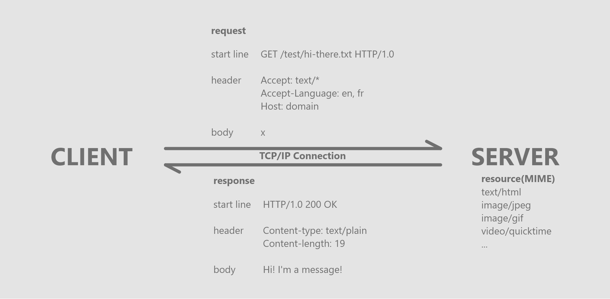

## TCP/IP 통신 및 리소스 표현 순서

1. 웹브라우저는 서버의 URL에서 호스트명을 추출한다.
2. 웹브라우저는 서버의 호스트 명을 IP로 변환한다.
3. 웹브라우저는 URL에서 포트번호가 있다면 추출한다.
4. 웹브라우저는 웹 서버와 TCP/IP 커넥션을 맺는다.
5. 웹브라우저는 서버에 HTTP 요청을 보낸다.
6. 서버는 웹브라우저에 HTTP 응답을 돌려준다.
7. 커넥션이 닫히면 웹브라우저는 문서를 보여준다.

#

## 웹의 구성요소

-   프락시: 웹 보안, 애플리케이션 통합, 성능 최적화
-   캐시: 사본 저장 HTTP 프락시 서버
-   게이트웨이: 프로토콜 변환 서버
-   터널: 날것의 데이터를 열어보지 않고 그대로 전달하는 HTTP 애플리케이션
-   에이전트: HTTP 요청을 만들어주는 클라이언트 프로그램
