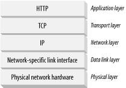

# 1장 HTTP 개관

## 1.1/1.2 HTTP, 웹 클라이언트/서버

- HTTP는 대량의 정보를 빠르고 간편하고 정확하게 브라우저로 옮겨준다.
- 신뢰성 있는 데이터 전송 프로토콜을 사용해 데이터 손상을 보장한다.
- HTTP 클라이언트와 HTTP 서버는 월드 와이드 웹의 기본 요소다.

 

## 1.3 리소스

웹 서버는 웹 리소스를 관리하고 제공한다. 어떤 종류의 콘텐츠 소스도 리소스가 될 수 있다.

### 미디어 타입

웹 서버는 모든 HTTP 객체 데이터에 **MIME**(Multipurpose Internet Mail Extension) 타입을 붙인다.

- 브라우저는 서버로 부터 객체를 돌려 받을 때 MIME 타입(content-type)을 통해 다룰 수 있는 객체인지 확인한다.
- image/jpeg, text/html, video/quicktime 등 `주 타입/ 부 타입`으로 이루어진 문자열 라벨이다.

### URI

**URI**는 서버 리소스를 고유하게 식별하고 위치를 지정할 수 있는 통합 자원 식별자(uniform resource identifier)다.

URI에는 URL과 URN 두 종류가 있으며 오늘 날의 대부분의 URI는 URL이다.

### URL

**URL**은 서버의 한 리소스에 대한 구체적인 위치를 서술하는 통합 자원 지시자(uniform resource locator)다.

- 첫 부분은 스킴이라고 하며 프로토콜을 서술한다.(http://)
- 두 번째 부분은 인터넷 주소를 제공한다.(www.domain.com)
- 마지막 부분은 리소스를 가리킨다. (/specials/saw.gif)

### URN

**URN**은 유니폼 리소스 이름(uniform resource name)으로서 리소스 위치에 영향을 받지않는 독립적인 이름 역할을 한다.

- 리소스가 이름을 변하지않게 유지되는한 여러 종류의 프로토콜로 접근해도 문제 없다.
- 실제 자원을 찾기 위해서 URN을 URL로 변환하여 이용한다.

 

## 1.4 트랜잭션

HTTP 트랜잭션은 요청 명령과 응답 결과로 구성되며 이 상호작용은 HTTP 메시지를 이용해 이루어진다.

- HTTP는 HTTP 메서드, 즉 여러가지 종류의 요청 명령을 지원한다.
- HTTP 응답 메시지는 상태 코드와 함께 반환된다.(200, 302, 404)
- 웹 페이지는 리소스들에 대해 별개의 HTTP 트랜잭션을 필수로 한다.

 

## 1.5 메시지

HTTP 요청과 응답은 시작줄, 헤더, 본문으로 이루어진 텍스트 HTTP 메시지로 형식을 갖는다. (_3장에서 자세히 나올 예정_)

 

## 1.6 TCP 커넥션

HTTP 메시지가 TCP(전송 제어 프로토콜) 커넥션을 통해 다른 곳으로 옮겨지는지 알아보자.

### TCP/IP

HTTP는 애플리케이션 계층 프로토콜이다. 네트워크 통신의 세부사항에 대해서 신경쓰지 않고 인터넷 전송 프로토콜인 TCP/IP에게 맡긴다.

- TCP는 오류 없는 데이터 전송, 순서 보장을 제공하고 데이터를 어떤 크기로든 보낼 수 있게 해준다.
- 일단 TCP 커넥션이 맺어지면, 클라이언트-서버 간의 HTTP 메시지가 없어지거나, 손상되거나, 순서가 바뀌어 수신되는 일은 결코 없다.
- TCP/IP는 TCP와 IP가 층을 이루는 패킷 교환 네트워크 프로토콜의 집합이다.
- TCP/IP는 네트워크와 하드웨어의 특성을 숨기고 신뢰성 있는 의사소통을 하게 해준다.

### 접속, IP 주소 그리고 포트번호

HTTP 클라이언트가 서버에 메시지를 전송할 수 있게 되기 전에 IP 주소와 포트번호를 사용해 클라이언트와 서버 사이에 TCP/IP 커넥션을 맺어야 한다.

- TCP에서는 서버 컴퓨터에 대한 IP 주소와 서버에서 실행 중인 프로그램이 사용중인 포트번호가 필요하다.
- HTTP 서버의 IP 주소와 포트번호는 URL을 이용하면 된다.
- 포트번호는 기본 값이 80이다.

### 서버에서 클라이언트에게 HTML 리소스를 보여주는 과정

1. 웹 브라우저는 서버의 URL에서 호스트 이름을 추출한다.
2. 호스트 명을 IP로 변환한다.
3. URL에서 포트번호를 추출한다.
4. 웹 서버와 TCP 커넥션을 맺는다.
5. 서버에 HTTP 요청을 보낸다.
6. 서버는 웹브라우저에 응답을 돌려준다.
7. 커넥션이 닫히면 웹브라우저는 문서를 보여준다.

 

## 1.8 웹의 구성요소

인터넷과 상호작용할 수 있는 웹 애플리케이션의 종류는 다양하다.

- 프락시: 클라이언트와 서버 사이에서 클라이언트의 모든 HTTP 요청을 받아 서버에 전달한다. 또한 요청과 응답을 필터링한다.
- 캐시: 많이 찾는 웹페이지의 사본을 클라이언트 가까이에 보관해 빠르게 다운받을 수 있도록 하는 HTTP 프락시 서버다.
- 게이트웨이: HTTP 트랙픽을 다른 프로토콜로 변환하기 위해 사용하는 특별한 서버다.
- 날(raw): 커넥션 사이에서 로우 데이터를 열어보지 않고 전달해주는 HTTP 애플리케이션이다.
- 에이전트: 사용자를 위해 HTTP 요청을 만들어주는 클라이언트 프로그램이다. 예를 들어 웹브라우저는 HTTP 에이전트다.
