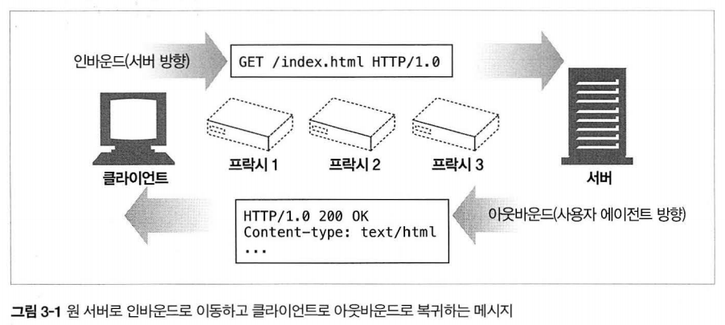
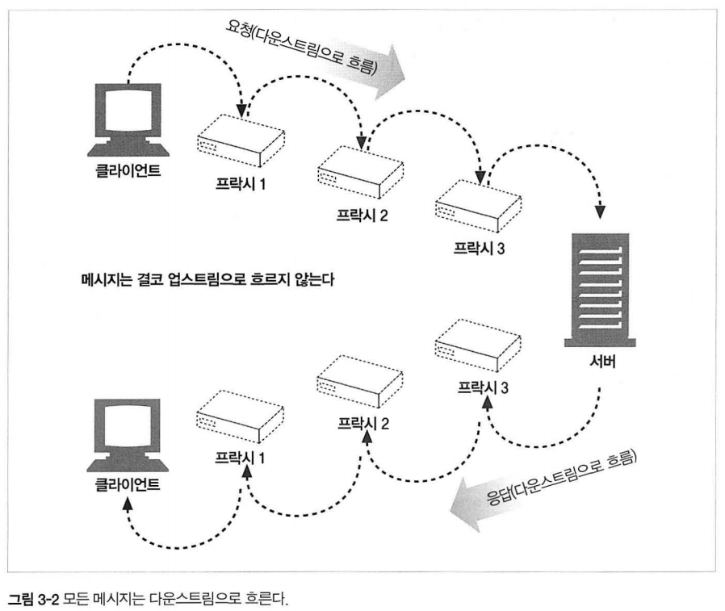
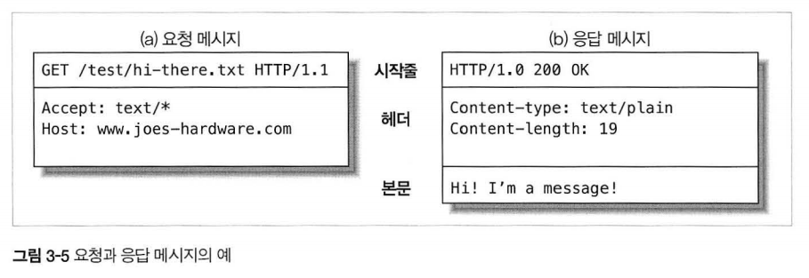
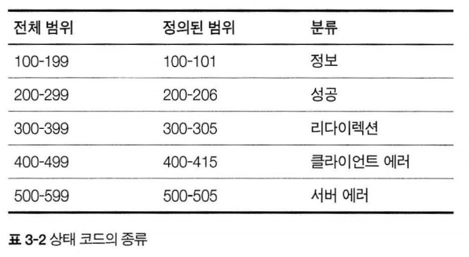
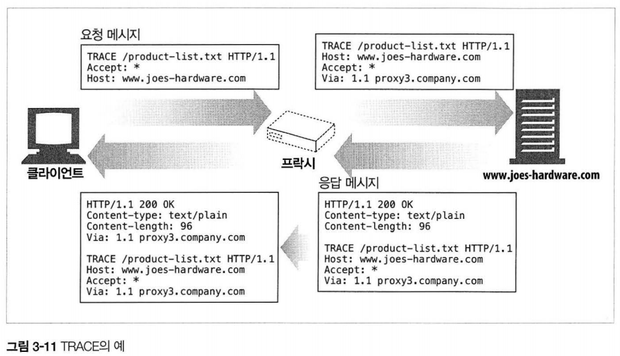
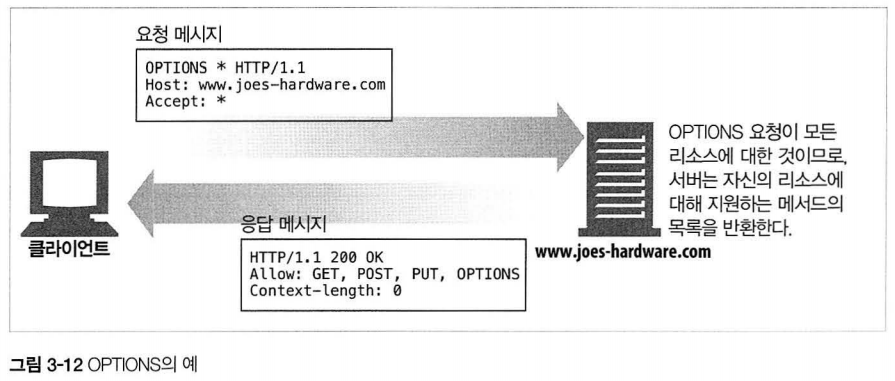

# 3장 HTTP 메시지

## 3.1 메시지의 흐름

- HTTP 메시지는 텍스트 메타 정보로 시작하고 선택적으로 데이터가 올 수 있다.
- 메시지는 클라이언트, 서버, 프락시 사이를 흐른다.

### 3.1.1 메시지는 원 서버 방향을 인바운드로 하여 송신된다.



- 인바운드: 메시지가 서버로 향하는 것이다.
- 아웃바운드: 모든 처리가 끝난 뒤 메시지가 사용자 에이전트로 돌아오는 것이다.

### 3.1.2 다운스트림으로 흐르는 메시지



- 모든 메시지는 업스트림(발송자)에서 다운스트림(수신자)으로 흐른다.

<br>

## 3.2 메시지의 각 부분



- 메시지는 시작줄(어떤 메시지인가), 헤더(속성), 본문(데이터) 세 부분으로 이루어진다.
- 본문은 선택적인 데이터 덩어리이다.
- 헤더는 빈 줄(CRLF)로 끝나 헤더 목록의 끝과 엔터티 본문의 시작을 표시한다.

### 3.2.1. 메시지 문법


#### 요청 메시지

```
GET /specials/saw-blade.gif HTTP/1.0
HOST: www.joes-hardware.com
```

```
<메서드> <요청URL> <버전>
<헤더>

<엔터티 본문>
```

#### 응답 메시지

```
HTTP/1.0 200 OK
Content-Type: image/gif
Content-Length: 8572
```

```
<버전> <상태 코드> <사유 구절>
<헤더>

<엔터티 본문>
```

- 사유 구절은 오로지 사람에게 읽히기 위한 목적으로 존재한다.
- 엔터티 본문이 없더라도 규칙상 헤더의 집합은 빈 줄로 끝나야 한다.

### 3.2.2 시작줄

- 시작줄은 무엇을 해야하는지 말해준다.
- HTTP 버전의 각 숫자는 따로따로 비교해야 한다. (HTTP/2.22 > HTTP/2.3, 22 > 3)

#### 요청 메시지의 시작줄

- 메서드로 시작하며 서버에게 무엇을 해야하는지 말해준다.
- 메서드 중 POST, PUT 메서드만 메시지 본문을 갖는다.

#### 응답 메시지의 시작줄

- 클라이언트에게 무엇이 일어났는지 말해준다.
- 

### 3.2.3 헤더

- 헤더 필드는 요청과 응답 메시지에 추가 정보를 더한다.
- 주로 Date, Content-lengt, Content-type, Accept가 쓰인다.
- 긴 헤더 줄은 공백 문자를 통해 여러 줄로 쪼갤 수 있다.

### 3.2.4 엔터티 본문

> 엔터티란 HTTP 메시지 바디에 적재되는 실제 데이터를 의미한다. 15장에서 자세히 나올 예정이다.

- 엔터티 본문은 HTTP 메시지의 화물이다.

### 3.2.5 버전 0.9 메시지

- 0.9 버전에서의 요청은 메서드와 요청 URL로, 응답은 엔터티로만 구성되어 있다.
- 단순하게 설계되어 다양한 상황에 대응할 수 없다.

<br>

## 3.3 메서드

### 3.3.1 안전한 메서드

- 안전한 메서드란 HTTP 요청의 결과로 서버에 어떤 작용도 없음을 의미한다.(GET, HEAD)
- 그러나 웹이 어떻게 개발되냐에 따라 안전한 메서드도 서버에 작용을 유발할 수 있다.

### 3.3.3 HEAD 메서드

- GET과 메시지 형태가 정확히 일치하지만 엔터티 본문은 반환되지 않고 헤더만 반환된다.
- 리소스를 가져오지 않고 무엇인가를 알 수 있다.
- 응답 상태 코드를 통해 개체가 존재하는지 확인할 수 있다.
- 헤더를 확인해 리소스가 변경되었는지 검사할 수 있다.
- HTTP 1.1 준수를 위해 HEAD 메서드가 반드시 구현되어 있어야 한다.

### 3.3.6 TRACE



- TRACE 메서드는 서버에 요청이 전달 되었을 때 요청이 어떻게 보이는지 클라이언트에게 보여준다.
- 주로 진단을 위해 사용하며 프락시나 애플리케이션들이 요청에 어떤 영향을 미치는지 확인할 수 있는 수단이다.

### 3.3.7 OPTIONS



- OPTIONS 메서드는 특정 자원에 대해 어떤 메서드를 지원하는지 확인할 수 있다.

<br>

## 3.4 상태 코드

[참고](https://velog.io/@sangyeon217/http-status-code)

<br>

## 3.5 헤더

- 일반 헤더: 클라이언트와 서버 양쪽 모두 사용하는 헤더다.
  - Date: "메시지 생성 일시"
- 요청 헤더
  - Accept: _/_
- 응답 헤더
  - Server: TIki-Hut/1.0
- 엔터티 헤더: 엔터티 본문에 대한 헤더
  - Content-Type: text/html;
- 확장 헤더: 개발자들에 의해 만들어진 비표준 헤더다.

자세한 내용은 이 [블로그](https://velog.io/@jkijki12/HTTP-Header-%EC%A0%95%EB%A6%AC#:~:text=Http%20Header%EB%8A%94%20%EB%8B%A4%EC%9D%8C%EA%B3%BC,%EB%8A%94%20%EA%B4%80%EB%A0%A8%EC%9D%B4%20%EC%97%86%EB%8A%94%20%ED%97%A4%EB%8D%94.&text=Entity%20header%3A%20%EC%BB%A8%ED%85%90%EC%B8%A0%20%EA%B8%B8%EC%9D%B4%EB%82%98,%EC%A0%95%EB%B3%B4%EB%A5%BC%20%ED%8F%AC%ED%95%A8%ED%95%98%EB%8A%94%20%ED%97%A4%EB%8D%94.)를 참고하자.

<br>

## Highlight: POST와 PUT 메서드의 차이

- POST는 요청 메시지에 포함된 엔터티를 이용해 새로운 자원을 생성해 내는것이고, PUT은 요청 메시지와 함께 넘어온 식별자의 자원을 만드는것이다.
- 똑같은 메시지로 2번 요청하게 되면 POST는 2개의 자원을 생성하지만 PUT은 첫 요청은 생성, 두 번째 요청은 교체하게 된다.

**이 두 메서드의 차이는 여러 번 수행해도 결과가 같은 멱등성 여부와 자원 결정권으로 구분할 수 있다.**([출처](https://blog.embian.com/66))

- POST는 위의 예시와 같이 계속해서 자원을 추가하므로 멱등하지 않다. 반면 PUT은 멱등하다고 할 수 있다.
- PUT은 식별자를 시작줄(요청 URL)로 함께 보낸다. 이것은 이미 자원의 위치를 알고 있다는 의미이다. 이에 반해 POST는 자원 위치를 모르기 때문에 식별자를 포함하지 않고 보낸다.

<br>

## Summary

정리한 내용을 바탕으로 3장 첫 부분의 질문들을 답변해보자.

- 메시지는 어떻게 흘러가는가
- HTTP 메시지의 세 부분에 대해 설명할 수 있는가
- 요청과 응답 메시지의 차이는 무엇인가
- 요청 메시지가 지원하는 메서드는 무엇이 있는가
- 응답 메시지가 반환하는 여러 상태 코드들은 무엇인가
- 여러 HTTP 헤더들은 무슨 일을 하는가
