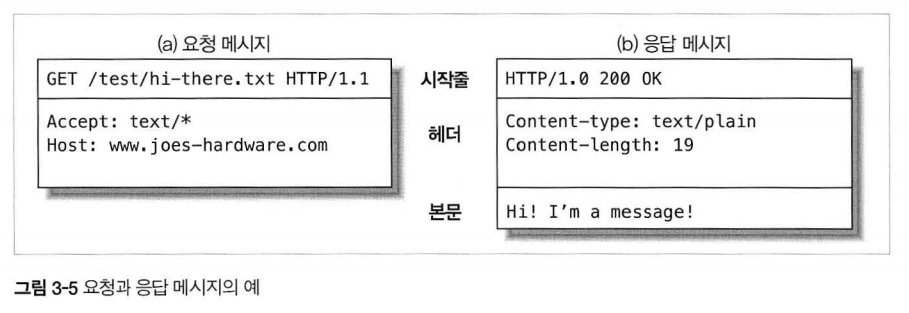
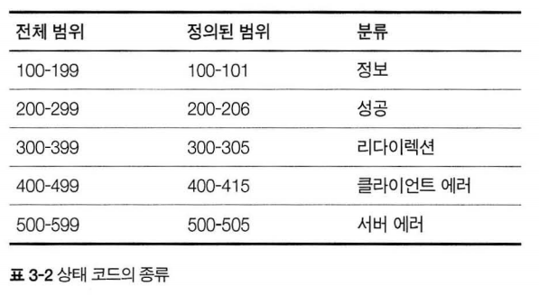

# 3장 HTTP 메시지

## 3.1 메시지의 흐름

### 3.1.1 메시지는 원 서버 방향을 인바운드로 하여 송신된다.

- 인바운드: 서버로 향하는 메시지
- 아웃바운드: 처리가 끝난 뒤 사용자 에이전트로 돌아오는 메시지

### 3.1.2 다운스트림으로 흐르는 메시지
- 모든 메시지는 업스트림(발송자)에서 다운스트림(수신자)으로 흐른다.

## 3.2 메시지의 각 부분


- 메시지는 시작줄(어떤 메시지인가), 헤더(속성), 본문(데이터) 세 부분으로 이루어진다.
- 본문은 선택적인 데이터 덩어리이다.
- 헤더는 빈 줄(CRLF)로 끝나 헤더 목록의 끝과 엔터티 본문의 시작을 표시한다.

### 3.2.1. 메시지 문법

#### 요청 메시지

```
GET /specials/saw-blade.gif HTTP/1.0
HOST: www.joes-hardware.com
```

```
<메서드> <요청URL> <버전>
<헤더>

<엔터티 본문>
```

#### 응답 메시지

```
HTTP/1.0 200 OK
Content-Type: image/gif
Content-Length: 8572
```

```
<버전> <상태 코드> <사유 구절>
<헤더>

<엔터티 본문>
```

### 3.2.2 시작줄

#### 요청 메시지의 시작줄
- 메서드로 시작하며 무엇을 해야하는지 말해준다.
- POST, PUT 메서드만 메시지 본문을 갖는다.

#### 응답 메시지의 시작줄
- 클라이언트에게 무엇이 일어났는지 말해준다.

### 3.2.3 헤더
- 요청과 응답 메시지에 추가 정보를 더한다.
- 주로 Date, Content-lengt, Content-type, Accept가 쓰인다.
- 
### 3.2.4 엔터티 본문
- HTTP 메시지 body에 적재되는 실제 데이터를 의미

### 3.2.5 버전 0.9 메시지
- 0.9 버전에서의 요청은 메서드와 요청 URL로, 응답은 엔터티로만 구성되어 있다.
- 단순하게 설계되어 다양한 상황에 대응할 수 없다.

## 3.3 메서드

### 3.3.1 안전한 메서드
- 안전한 메서드란 HTTP 요청의 결과로 서버에 어떤 작용도 없음을 의미한다.(GET, HEAD)
- 어떻게 개발되냐에 따라 안전한 메서드도 서버에 작용을 유발할 수 있다.

### 3.3.3 HEAD 메서드
- GET과 메시지 형태가 정확히 일치하지만 엔터티 본문은 반환되지 않고 헤더만 반환된다.
- 리소스를 가져오지 않고 무엇인가를 알 수 있다.
- 응답 상태 코드를 통해 개체가 존재하는지 확인할 수 있다.
- 헤더를 확인해 리소스가 변경되었는지 검사할 수 있다.
- HTTP 1.1 준수를 위해 HEAD 메서드가 반드시 구현되어 있어야 한다.


## 3.4 상태 코드


## 3.5 헤더
- 일반 헤더: 클라이언트와 서버 양쪽 모두 사용하는 헤더
  - ex) Date: Tue, 3 Oct 1974 02:16:00 GMT
- 요청 헤더: 요청 메시지를 위한 헤더
  - ex) Accpt: */*
- 응답 헤더: 클라이언트에게 젇ㅇ보를 제공하기 위한 자신만의 헤더
  - Server: TIki-Hut/1.0
- 엔터티 헤더: 엔터티 본문에 대한 헤더
  - Content-Type: text/html;
- 확장 헤더: 개발자들에 의해 만들어진 비표준 헤더

## 질문
- HTTP 메시지의 세 부분이 의미하는 것과 역할
- 요청, 응답 메시지의 차이
- 요청 메시지가 지원하는 메서드의 종류와 특징
- 응답 메시지가 반환하는 여러 상태 코드들의 의미, 실제로 어떤 상황에 사용되는지
- 메서드에 따라 본문이 없는 메서드는 본문을 담아 요청할 수는 없을까?
- 여러 HTTP 헤더들의 의미와 역할