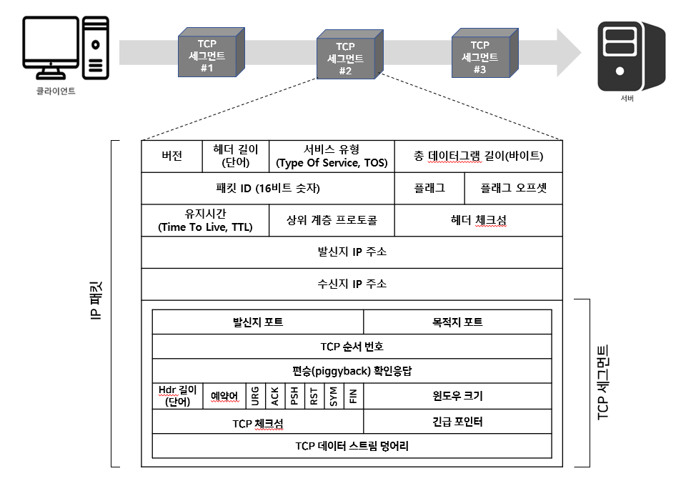
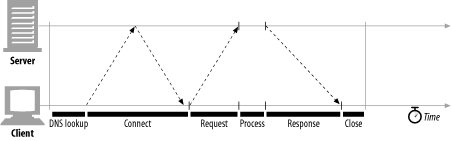
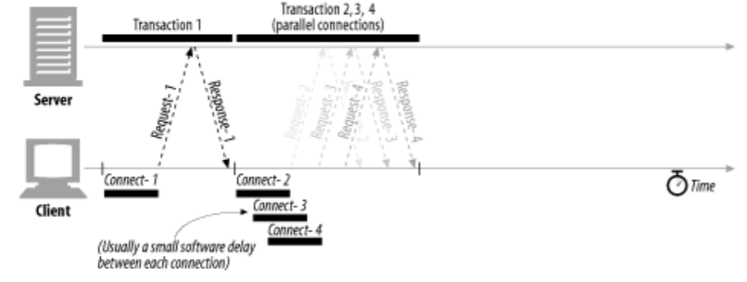
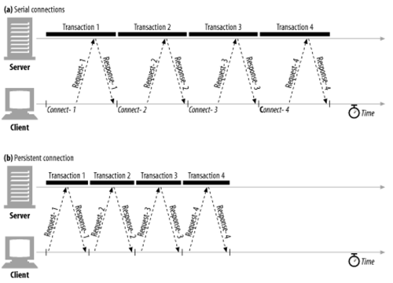
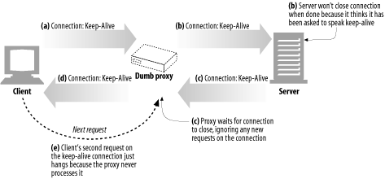
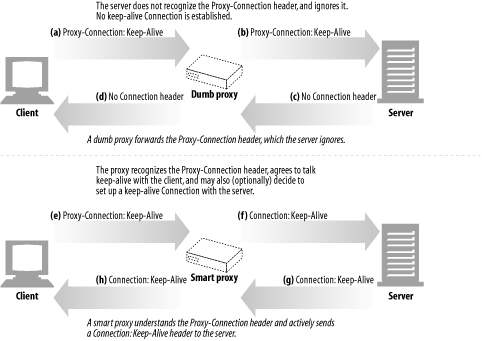
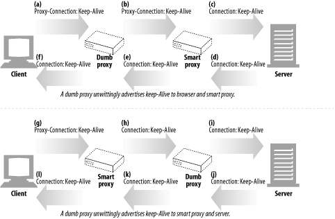
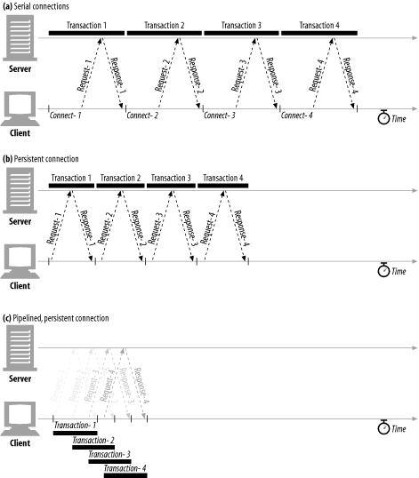

# 4장 커넥션 관리

## 4.1 TCP 커넥션
- 전 세계 모든 HTTP통신은 TCP/IP를 통해 이루어진다.
- 일단 커넥션이 맺어지면 클라이언트와 서버 컴퓨터 간에 주고받는 메시지들은 손실 혹은 손상되거나 순서가 바뀌지 않고 안전하게 전달된다.

- URL을 입력받은 브라우저가 수행하는 7단계 과정
  1. 브라우저가 호스트 명을 추출한다.
  2. 브라우저가 이 호스트 명에 대한 IP 주소를 찾는다.
  3. 브라우저가 포트 번호를 얻는다.
  4. 브라우저가 IP 주소의 포트 번호로 TCP 커넥션을 생성한다.
  5. 브라우저가 서버로 HTTP GET 요청 메시지를 보낸다. 
  6. 브라우저가 서버에서 온 HTTP 응답 메시지를 읽는다.
  7. 브라우저가 커넥션을 끊는다.

### 4.1.1 신뢰할 수 있는 데이터 전송 통로인 TCP

- HTTP 커넥션은 몇몇 사용 규칙을 제외하고는 TCP 커넥션에 불과하다.
- TCP 커넥션은 인터넷을 안정적으로 연결해준다.

### 4.1.2 TCP 스트림은 세그먼트로 나뉘어 IP 패킷을 통해 전송된다

- TCP는 IP 패킷(혹은 IP 데이터그램)이라고 불리는 작은 조각을 통해 데이터를 전송한다.
- HTTP가 메시지를 전송할 때 현재 연결되어있는 커넥션을 통해서 메시지를 순서대로 보낸다.
- TCP는 세그먼트라는 단위로 데이터 스트림을 잘게 나누고, 세그먼트를 IP 패킷이라고 불리는 봉투에 담아서 인터넷을 통해 데이터를 전달한다.

### 4.1.3 TCP 커넥션 유지하기
- TCP 커넥션은 네 가지 값으로 식별한다.
  > <발신지 IP 주소, 발신지 포트, 수신지 IP 주소, 수신지 포트>

### 4.1.4 TCP 소켓 프로그래밍

- 소켓(Socket)이란?
  - 프로그램이 네트워크에서 데이터를 송수신할 수 있도록 `"네트워크 환경에 연결할 수 있게 만들어진 연결부"`
  - 두 프로그램이 네트워크를 통해 서로 통신을 수행할 수 있도록 양쪽에 생성되는 링크의 단자이다.
  - 두 소켓이 연결되면 서로 다른 프로세스끼리 데이터를 전달할 수 있다.
  - 상대방에게 데이터를 보내거나 받는 역할을 한다.

- TCP/IP 소켓 통신이란?
  - 클라이언트 프로그램과 서버 프로그램은 각각 자신의 포트를 통해 통신을 해야 하는데, 소켓을 통해 연결한다.

- 클라이언트 소켓과 서버 소켓
  - 최초 어느 한 곳(클라이언트)에서 그 대상(서버)이 되는 곳으로 연결을 요청한다.
  - IP 주소와 포트 번호로 식별되는 대상에게, 자신이 데이터 송수신을 위한 네트워크 연결 의사가 있음을 알리는 것이다.
  - 그 대상(서버)이 요청을 받아들일 준비가 되어있지 않다면 요청은 무시되기 때문에 어떤 연결 요청을 받아들일 것인지 미리 알고 등록해야 한다.
  - 연결을 요청하는 쪽이 클라이언트 소켓, 받아들이는 쪽이 서버 소켓이다.
  - 서버 소켓은 연결 요청을 받아들이는 역할만 수행할 뿐 새로 만들어지는 소켓으로 데이터를 통신한다.

## 4.2 TCP의 성능에 대한 고려

- HTTP는 TCP 바로 위에 있는 계층이기 때문에, HTTP 트랜잭션의 성능은 TCP 성능에 영향을 받는다.

### 4.2.1 HTTP 트랜잭션 지연

- 트랜잭션 처리시간은 TCP 커넥션을 설정하고, 요청하고, 응답 메시지를 보내는 것에 비하면 상당히 짧다.
- 클라이언트나 서버가 너무 많은 데이터를 내려받거나 복잡하고 동적인 자원들을 실행하지 않는 한, 대부분의 HTTP 지연은 TCP 네트워크 지연 때문에 발생

1. 클라이언트는 URI에서 웹 서버의 IP 주소와 포트 번호를 알아내야 합니다. 만약 URI에 기술되어 있는 호스트에 방문한 적이 최근에 없으면, DNS 이름 분석 인프라를 사용하여 URI에 있는 호스트 명을 IP 주소로 변환하는데 수십 초의 시간이 걸릴 것입니다.
2. 클라이언트는 TCP 커넥션 요청을 서버에게 보내고 서버가 커넥션 허가 응답을 회신하기를 기다립니다. 커넥션 설정 시간은 새로운 TCP 커넥션에서 항상 발생합니다. 이는 보통 1~2초의 시간이 소요되지만, 수백 개의 HTTP 트랜잭션이 만들어지면 소요시간이 크게 증가될 것입니다.
3. 커넥션이 맺어지면 클라이언트는 HTTP 요청을 새로 생성된 TCP 파이프를 통해 전송합니다. 웹 서버는 데이터가 도착하는 대로 TCP 커넥션에서 요청 메시지를 읽고 처리합니다. 요청 메시지가 인터넷을 통해 전달되고 서버에 의해서 처리되는 데까지는 시간이 소요됩니다.
4. 웹 서버가 HTTP 응답을 보내는 것 역시 시간이 소요됩니다.

이런 TCP 네트워크 지연은 하드웨어의 성능, 네트워크와 서버의 전송 속도, 요청과 응답 메시지의 크기, 클라이언트와 서버 간의 거리에 다라 크게 달라집니다. 또한 TCP 프로토콜의 기술적인 복잡성도 지연에 큰 영향을 끼칩니다.

### 4.2.2 성능 관련 중요 요소

- TCP 커넥션의 핸드셰이크 설정
- 인터넷의 혼잡을 제어하기 위한 TCP의 느린 시작(slow-start)
- 데이터를 한데 모아 한 번에 전송하기 위한 네이글(nagle) 알고리즘
- TCP의 편승(piggyback) 확인응답(acknowledgment)을 위한 확인응답 지연 알고리즘
- TIME_WAIT 지연과 포트 고갈

### 4.2.3 TCP 커넥션 핸드셰이크 지연
- 새로운 TCP 커넥션을 열 때면, TCP 소프트웨어는 커넥션을 맺기 위한 조건을 맞추기 위해 연속으로 IP 패킷을 교환합니다.
- 작은 크기의 데이터 전송에 커넥션이 사용된다면 이런 패킷 교환은 HTTP 성능을 크게 저하시킬 수 있습니다.

- TCP 커넥션 핸드셰이크 순서
  1. 클라이언트는 TCP 커넥션을 생성하기 위해 작은 TCP 패킷을 서버에게 보냅니다. 그 패킷은 'SYN'라는 특별한 플래그를 가지는데, 커넥션 생성 요청이라는 뜻입니다.
  2. 서버가 그 커넥션을 받으면 몇 가지 커넥션 매개변수를 산출하고, 커넥션 요청이 받아들여졌음을 의미하는 'SYN'과 'ACK' 플래그를 포함한 TCP 패킷을 클라이언트에게 보냅니다.
  3. 마지막으로 클라이언트는 커넥션이 잘 맺어졌음을 알리기 위해서 서버에게 다시 확인응답 신호를 보냅니다. 오늘날의 TCP는 클라이언트가 이 확인응답 패킷과 함께 데이터를 보낼 수 있습니다.

- 문제점
  - 프로그래머는 이 패킷들을 보지 못하고 새로운 TCP 커넥션이 생성될 때 발생하는 지연만을 볼 수 있습니다.
  - 트랜잭션이 아주 큰 데이터를 주고받지 않는 평범한 경우에는, SYN/SYN+ACK 핸드셰이크가 눈에 띄는 지연을 발생시킵니다.
  - TCP의 ACK 패킷은 HTTP 요청 메시지 전체를 전달할 수 있을 만큼 큰 경우가 많고, 많은 HTTP 서버 응답 메시지는 하나의 IP 패킷에도 담길 수 있습니다.
  - 결국, 크기가 작은 HTTP 트랜잭션은 50% 이상의 시간을 TCP를 구성하는 데 씁니다.

### 4.2.4 확인응답 지연
- 인터넷 자체가 패킷 전송을 완벽히 보장하지는 않기 때문에, TCP는 성공적인 데이터 전송을 보장하기 위해서 자체적인 확인 체계를 가집니다.
- 각 TCP 세그먼트는 순번과 데이터 무결성 체크섬을 가집니다. 각 세그먼트의 수신자는 세그먼트를 온전히 받으면 작은 확인응답 패킷을 송신자에게 반환합니다.
- 만약 송신자가 특정 시간 안에 확인응답 메시지를 받지 못하면 패킷이 파기되었거나 오류가 있는 것으로 판단하고 데이터를 다시 전송합니다.
- 확인응답은 그 크기가 작기 때문에, TCP는 같은 방향으로 송출되는 데이터 패킷에 확인응답을 '편승(piggyback)' 시킵니다.(네트워크를 좀 더 효율적으로 사용)
- 송출할 확인응답을 특정 시간 동안 버퍼에 저장해 두고, 확인응답을 편승시키기 위한 송출 데이터 패킷을 찾습니다.
- 만약 일정 시간 안에 송출 데이터 패킷을 찾지 못하면 확인응답은 별도 패킷을 만들어 전송합니다 (확인응답 지연 알고리즘).

- 문제점
  - 요청과 응답 두 가지 형식으로만 이루어지는 HTTP 동작 방식에서 막상 편승할 패킷을 찾으려고 하면 해당 방향으로 송출될 패킷이 많지 않기 때문에, 확인응답 지연 알고리즘으로 인한 지연이 자주 발생합니다.

### 4.2.5 TCP 느린 시작(slow start)
- 느린 시작은 네트워크를 통해 전송되는 데이터의 양을 조절하여 네트워크가 혼잡해지는 것을 방지합니다.
- 각 패킷으로 전송할 수 있는 데이터의 양을 정의하여 발신자와 수신자 간의 연결을 협상하고 네트워크 용량에 도달할 때까지 데이터 양을 천천히 늘립니다.
- 인터넷의 급작스러운 부하와 혼잡을 방지하는 데 쓰입니다.

- 문제점 
  - 혼잡제어 기능 때문에, 새로운 커넥션은 이미 어느 정도 데이터를 주고받은 '튜닝'된 커넥션보다 느립니다.

### 4.2.6 네이글(Nagle) 알고리즘과 TCP_NODELAY
- 네트워크 효율을 위해서, 패킷을 전송하기 전에 많은 양의 TCP 데이터를 한 개의 덩어리로 합칩니다.
- 세그먼트가 최대 크기가 되지 않으면 전송을 하지 않고 다만, 다른 모든 패킷이 확인응답을 받았을 경우에는 최대 크기보다 작은 패킷의 전송을 허락합니다.

- 문제점
  - 크기가 작은 HTTP 메시지는 패킷을 채우지 못하기 때문에, 앞으로 생길지 생기지 않을지 모르는 추가적인 데이터를 기다리며 지연될 것입니다.
  - 확인응답 지연과 함께 쓰일 경우 확인응답이 도착할 때까지 데이터 전송을 멈추고 있는 반면, 확인응답 지연 알고리즘은 확인응답을 100~200밀리초 지연시킵니다.

### 4.2.7 TIME_WAIT의 누적과 포트 고갈
- TCP 커넥션의 종단에서 TCP 커넥션을 끊으면, 종단에서는 커넥션의 IP 주소와 포트 번호를 메모리의 작은 제어영역에 기록해 놓습니다.
- 같은 주소와 포트 번호를 사용하는 새로운 TCP 커넥션이 일정 시간 동안에는 생성되지 않게 하기 위한 것입니다.
- 만약 이전 커넥션의 패킷이 그 커넥션과 같은 연결값으로 생성된 커넥션에 삽입되면, 패킷은 중복되고 TCP 데이터는 충돌할 것입니다.

- 문제점
  - 서버에 접속할 때마다 유일한 커넥션을 생성하기 위해서 새로운 포트를 쓰지만 사용할 수 있는 포트의 수는 제한되어 있어 고갈될 수 있다.
  - 포트 고갈 문제를 겪지 않더라도 커넥션을 너무 많이 맺거나 대기 상태인 제어 블록이 많아지는 경우 극심하게 느려지는 운영체제도 있음.

## 4.3 HTTP 커넥션 관리

### 4.3.1 흔히 잘못 이해하는 Connection 헤더
- HTTP는 클라이언트와 서버 사이에 프락시 서버, 캐시 서버 등과 같은 중개 서버가 놓이는 것을 허락하고 중개 서버들을 하나하나 거치면서 전달됩니다.
- 두 개의 인접한 HTTP 애플리케이션이 현재 맺고 있는 커넥션에만 적용될 옵션을 지정해야 할 때가 있습니다.
- Connection 헤더는 전송자가 특정 커넥션에만 해당되는 옵션을 지정하게 해줍니다.
- Connection 헤더에는 다음 세 가지 종류의 토큰이 전달될 수 있기 때문에 다소 혼란스러울 수 있다.
  - HTTP 헤더 필드 명은, 이 커넥션에만 해당되는 헤더들을 나열한다.
  - 임시적인 토큰 값은, 커넥션에 대한 비표준 옵션을 의미한다.
  - close 값은, 커넥션의 작업이 완료되면 종료되어야 함을 의미한다.

### 4.3.2 순차적인 트랜잭션 처리에 의한 지연
- 웹 페이지에 세 개의 이미지 파일이 있다고 가정할 때, 브라우저가 이 페이지를 보여주려면 네 개의 HTTP 트랜잭션을 만들어야 한다.
- 각 트랜잭션이 새로운 커넥션을 필요로 한다면, 커넥션을 맺는데 발생하는 지연과 함께 느린 시작 지연이 발생할 것이다.
- 순차적인 처리는 물리적 지연뿐 아니라, 하나의 이미지를 내려받는 동안 웹페이지의 나머지 공간에 아무런 변화가 없어서 생기는 심리적 지연도 있다.

- HTTP 커넥션의 성능을 향상시킬 수 있는 최신 기술 네 가지
  - 병렬(parallel) 커넥션: 여러 개의 TCP 커넥션을 통한 동시 HTTP 요청
  - 지속(persistnet) 커넥션: 커넥션을 맺고 끊는 데서 발생하는 지연을 제거하기 위한 TCP 커넥션의 재활용
  - 파이프라인(pipelined) 커넥션: 공유 TCP 커넥션을 통한 병렬 HTTP 요청
  - 다중(multiplexed) 커넥션: 요청과 응답들에 대한 중재 (실험적인 기술이다)

## 4.4 병렬 커넥션

- HTTP는 클라이언트가 여러 개의 커넥션을 맺음으로써 여러 개의 HTTP 트랜잭션을 병렬로 처리할 수 있게 한다.
- 이미지같은 내부 객체에 대한 HTML 태그에 폭과 높이 속성을 기술하면 레이아웃 지연을 없앨 수 있다.
- 브라우저는 서버에 객체들을 내려받기 전에 레이아웃을 그릴 수 있다.

### 4.4.1 병렬 커넥션은 페이지를 더 빠르게 내려받는다

- 단일 커넥션의 대역폭 제한과 커넥션이 동작하지 않고 있는 지연시간을 활용하면 여러개의 객체가 있는 웹 페이지를 더 빠르게 내려받을 수 있다.
- 각 커넥션의 지연 시간을 겹치게 하면 총 지연 시간을 줄일 수 있다.
- 클라이언트의 인터넷 대역폭을 한 개의 커넥션이 다 써버리는 것이 아니라면 나머지 객체를 내려받는 데에 남은 대역폭을 사용할 수 있다

### 4.4.2 병렬 커넥션이 항상 더 빠르지는 않다
- 클라이언트의 네트워크 대역폭이 좁을 때 대부분 시간을 데이터 전송하는데만 쓸 것이다.
- 여러개의 객체를 병렬로 내려받는 경우, 이 제한된 대역폭 내에서 각 객체를 전송받는 것은 느리기 때문에 성능상의 장점이 거의 없어진다.
- 브라우저는 실제로 병렬 커넥션을 사용하긴 하지만 적은 수(대부분 6~8개)의 병렬 커넥션만을 허용한다.
- 서버는 특정 클라이언트로부터 과도한 수의 커넥션이 맺어졌을 경우, 그것을 임의로 끊어버릴 수 있다.

### 4.4.3 병렬 커넥션은 더 빠르게 '느껴질 수' 있다
- 병렬 커넥션이 실제로 페이지를 더 빠르게 내려받는 것은 아니지만, 화면에 여러 개의 객체가 동시에 보이면서 내려받고 있는 상황을 볼 수 있기 때문에 사용자는 더 빠르게 내려받고 있다고 느낄 수 있다.

## 4.5 지속 커넥션
- 하나의 웹 페이지에 첨부된 이미지들이나 하이퍼링크들은 대부분 같은 웹 사이트를 가리킨다.
- 서버에 HTTP 요청을 하기 시작한 애플리케이션은 같은 서버에 또 요청하게 되는데 이것을 지역성(site locality)이라 부른다.
- HTTP/1.1을 지원하는 기기는 처리가 완료된 후에도 TCP 커넥션을 유지하여 다음 요청에도 재사용 할 수 있는데, 이것을 지속 커넥션이라 부른다.
- 지속 커넥션을 재사용함으로써, 커넥션을 맺기 위한 준비작업 시간을 절약할 수 있다.

### 4.5.1 지속 커넥션 vs 병렬 커넥션
- 병렬 커넥션의 단점
  - 각 트랜잭션마다 새로운 커넥션을 맺고 끊기 때문에 시간과 대역폭이 소요된다.
  - 각각의 새로운 커넥션은 TCP 느린 시작 때문에 성능이 떨어진다.
  - 실제로 연결할 수 있는 병렬 커넥션의 수에는 제한이 있다.
- 지속 커넥션의 장점
  - 커넥션을 맺기 위한 사전 작업과 지연을 줄여주고, 튜닝된 커넥션을 유지하며, 커넥션의 수를 줄여준다.
- 튜닝된 커넥션: TCP 느린 시작에서, 패킷을 수차례 성공적으로 전송한 결과로 한 번에 다수의 패킷을 전송할 수 있는 권한을 얻은 커넥션

`두 가지를 함께 사용할 때 가장 효과적이기 때문에 오늘날 많은 웹 애플리케이션은 적은 수의 병렬 커넥션만을 맺고 그것을 유지한다.`

### 4.5.2 HTTP/1.0+의 Keep-Alive 커넥션

- 많은 HTTP/1.0 브라우저와 서버들은 일찍부터 다소 실험적이었던 keep-alive 커넥션이라는 지속 커넥션을 지원하기 위해 확장되었다.
- 초기의 지속 커넥션은 설계상의 문제가 있었지만, HTTP/1.1에 수정되었다.

`keep-alive 커넥션의 성능상 장점으로 아래와 같이 커넥션을 맺고 끊는데 필요한 작업이 없어서 시간이 단축됨`
- 

### 4.5.3 Keep-Alive 동작
- Keep-Alive는 사용하지 않기로 결정되어 HTTP/1.1 명세에서 빠졌습니다.
- 하지만 아직도 브라우저와 서버 간에 keep-alive 핸드셰이크가 널리 사용되고 있기 때문에, HTTP 애플리케이션은 그것을 처리할 수 있게 개발해야 합니다.
- HTTP/1.0 keep-alive 커넥션을 구현한 클라이언트는 커넥션을 유지하기 위해서 요청에 Connection:Keep-Alive 헤더를 포함시킵니다.
- 이 요청을 받은 서버는 그 다음 요청도 이 커넥션을 통해 받고자 한다면, 응답 메시지에 같은 헤더를 포함시켜 응답합니다.

### 4.5.4 Keep-Alive 옵션
- Keep-Alive 헤더는 커넥션을 유지하기를 바라는 요청일 언제든지 현재의 keep-alive 커넥션을 끊을 수 있고, 처리되는 트랜잭션의 수를 제한할 수 있다.
- Keep-Alive 옵션
  - timeout 파라미터:커넥션이 얼마간 유지될 것인지를 의미하지만 이대로 동작한다는 보장은 없다.
  - max 파라미터: Keep-Alive 응답 헤더를 통해 보냅니다. 커넥션이 몇 개의 HTTP 트랜잭션을 처리할 때까지 유지될 것인지를 의미하지만 이대로 동작한다는 보장은 없다.
  - Keep-Alive 헤더: 진단이나 디버깅을 주목적으로 하는, 처리되지는 않은 임의의 속성들을 지원하기도 합니다. 이름[=값]
- Keep-Alive 헤더 사용은 선택 사항이지만, Connection: Keep-Alive 헤더가 있을 때만 사용할 수 있다.

### 4.5.5 Keep-Alive 커넥션 제한과 규칙
- Keep-Alive는 HTTP/1.0에서 기본으로 사용되지는 않습니다. 클라이언트는 Keep-Alive 커넥션을 사용하기 위해 Connection: Keep-Alive 요청 헤더를 보내야 합니다.
- 커넥션을 계속 유지하려면 모든 메시지에 Connection: Keep-Alive 헤더를 포함해 보내야 합니다.
- 클라이언트는 Connection: Keep-Alive 응답 헤더가 없는 것을 보고 서버가 응답 후에 커넥션을 끊을 것임을 알 수 있습니다.
- 커넥션이 끊어지기 전에 엔터티 본문의 길이를 알 수 있어야 커넥션을 유지할 수 있습니다. Content-Length
- 프락시와 게이트웨이는 Connection 헤더의 규칙을 철저히 지켜야 합니다. 프락시와 게이트웨이는 메시지를 전달하거나 캐시에 넣기 전에 Connection 헤더에 명시된 모든 헤더 필드와 Connection 헤더를 제거해야 합니다.
- 정석대로라면, Keep-Alive 커넥션은 Connection 헤더를 인식하지 못하는 프락시 서버와는 맺어지면 안됩니다.
- 기술적으로 HTTP/1.0을 따르는 기기로부터 받은 모든 Connection 헤더 필드는 무시해야 합니다. (오래된 프락시 서버로부터 실수로 전달될 수 있기 때문)
- 클라이언트는, 응답 전체를 모두 받기 전에 커넥션이 끊어졌을 경우, 별다른 문제가 없으면 요청을 다시 보낼 수 있게 준비되어 있어야 합니다.

### 4.5.6 Keep-Alive와 멍청한(dumb) 프락시

#### Connection 헤더의 무조건 전달
- 프락시는 Connection 헤더를 이해하지 못해서 해당 헤더들을 삭제하지 않고 요청 그대로를 다음 프락시에 전달합니다.
- 멍청한 프락시를 거쳐 웹 서버에 메시지를 전송했을 때 상황
  1. 웹 클라이언트는 프락시에 Connection: Keep-Alive 헤더와 함께 메시지를 보내고 커넥션 유지 요청에 대한 응답을 기다린다.
  2. 멍청한 프락시는 keep-alive를 이해하지 못하고 다음 서버로 메시지를 그대로 전달한다.
  하지만 Connection 헤더는 홉별 헤더(다음 서버로 전송되면 안되는 헤더)이기 때문에 여기부터 문제가 발생한다.
  3. 웹 서버가 프락시로부터 Connection: Keep-Alive 헤더를 받으면, 웹 서버는 프락시가 커넥션을 유지하자고 요청하는 것으로 잘못 판단한다.
  웹 서버는 프락시와 커넥션을 유지하는 것에 동의를 하고 Connection: Keep-Alive 헤더를 포함하여 응답한다.
  웹 서버는 프락시와 keep-alive 커넥션이 맺어져 있는 상태로 판단하여 그에 대한 규칙에 맞게 통신하지만 프락시는 keep-alive를 전혀 이해하지 못한다.
  4. 멍청한 프락시는 서버로부터 받은 Connection: Keep-Alive 헤더를 포함한 응답을 클라이언트에게 전달한다.
  클라이언트와 서버는 서로 keep-alive에 동의했다고 생각하지만 프락시는 이 상황을 전혀 이해하지 못한다.
  5. 프락시는 응답을 클라이언트에게 전달한 후 서버가 커넥션을 끊기를 기다린다.
  하지만 서버는 커넥션을 유지하는 것으로 알고 있기 때문에 커넥션을 끊지 않고 프락시는 계속 기다린다.
  6. 클라이언트는 다음 요청을 프락시에게 보내기 시작하는데, 프락시는 다음 요청이 오는 것을 예상하지 못하기 때문에,
  그 요청은 프락시로부터 무시되고 브라우저는 응답을 계속 기다리게된다.
  7. 이런 잘못된 통신 때문에, 브라우저는 자신이나 서버가 타임아웃이 나서 커넥션이 끊길 때까지 기다린다.

#### 프락시와 홉별 헤더
- 이런 종류의 잘못된 통신을 피하려면, 프락시는 Connection 헤더와 그에 명시된 헤더들은 절대 전달하면 안된다.
- 또한 Proxy-Authenticate, Proxy-Connection, Transfer-Encoding, Upgrade와 같은 홉별 헤더 역시 전달하면 안된다.

### 4.5.7 Proxy-Connection 살펴보기

- 멍청한 프락시 문제를 해결하기 위해 브라우저에서 일반적으로 전달하는 Connection 헤더 대신에 비표준인 Proxy-Connection 확장 헤더를 프락시에게 전달한다.
- 멍청한 프락시가 Proxy-Connection를 웹 서버에 보내더라도 웹 서버는 그것을 무시하기 때문에 별 문제가 되지 않는다.
- 영리한 프락시는 Proxy-Connection 헤더를 인식하고 서버로 Connection: Keep-Alive 헤더를 전달한다.
- 멍청한 프락시의 양옆에 영리한 프락시가 있다면 잘못된 헤더를 만들어내는 문제가 발생한다.
- 문제를 발생시키는 프락시들은 네트워크상에서 '보이지 않는' 경우가 많기 때문에 브라우저는 Proxy-Connection 헤더를 보낼 수 없다.

### 4.5.8 HTTP/1.1의 지속 커넥션
- HTTP/1.1에서는 keep-alive 대신 더 개선된 지속 커넥션을 지원한다.
- keep-alive와 달리 지속 커넥션은 기본적으로 활성화되어 있다. (별도의 설정을 하지 않는 한 모든 커넥션은 지속 커넥션)
- HTTP/1.1 애플리케이션은 지속 커넥션은 끊으려면 Conneciton: close 헤더를 명시해야 한다.
- Connection: close 헤더가 없으면 응답 후에도 커넥션은 유지하자는 것으로 추정하지만 클라이언트와 서버는 언제든 커넥션을 끊을 수 있다.

### 4.5.9 지속 커넥션의 제한과 규칙
- 클라이언트가 요청에 Connection: close 헤더를 포함해 보냈으면, 클라이언트는 그 커넥션으로 추가적인 요청을 보낼 수 없다.
- 클라이언트는 추가적인 요청이 없다면 마지막 요청에 Connection: close 헤더를 포함해 보내야 한다.
- 커넥션에 있는 모든 메시지는 엔터티 본문의 정확한 Content-Length 값을 가지거나 청크 전송 인코딩으로 인코드 되어 있어야 한다.
- HTTP/1.1 프락시는 클라이언트가 서버 각각에 대해 별도의 지속 커넥션을 맺고 관리해야 한다.
- HTTP/1.1 프락시 서버는 클라이언트가 커넥션 관련 기능에 대한 클라이언트의 지원 범위를 알고 있지 않은 한 지속 커넥션을 맺으면 안된다.
- HTTP/1.1 기기는 Connection 헤더의 값과는 상관없이 언제든지 커넥션을 끊을 수 있다.
- HTTP/1.1 애플리케이션은 중간에 끊어지는 커넥션을 복구할 수 있어야 하고, 클라이언트는 다시 보낼 수 있는 요청이라면 다시 보내야 한다.
- 하나의 클라이언트는 서버 과부하 방지를 위해 두 개 이상의 지속 커넥션을 유지해야 한다.(N명의 사용자가 서버로 접근한다면 2N개의 커넥션 유지)

## 4.6 파이프라인 커넥션

- 파이프라인 제약사항
  - HTTP 클라이언트는 커넥션이 지속 커넥션인지 확인하기 전까지는 파이프라인을 이어서는 안된다.
  - HTTP 응답은 요청 순서와 같게 와야 한다.
  - HTTP 클라이언트는 커넥션이 언제 끊어지더라도, 완료되지 않은 요청이 파이프라인에 있으면 언제든 다시 요청을 보낼 준비가 되어 있어야 한다.
  - HTTP 클라이언트는 POST 요청같이 반복해서 보낼 경우 문제가 생기는 요청은 파이프라인을 통해 보내면 안된다.// 비멱등(nonidempotent)

## 4.7 커넥션 끊기에 대한 미스터리

### 4.7.1 '마음대로' 커넥션 끊기
- 어떠한 HTTP 클라이언트, 서버, 혹은 프락시든 언제든지 TCP 전송 커넥션을 끊을 수 있습니다.
- 보통 커넥션은 메시지를 다 보낸 다음 끊지만, 에러가 있는 상황에서는 헤더의 중간이나 다른 엉뚱한 곳에서 끊길 수 있습니다.
- 지속 커넥션이 일정 시간 동안 요청을 전송하지 않고 유휴 상태에 있으면 서버는 그 커넥션을 끊을 수 있습니다.

### 4.7.2 Content-Length와 Truncation
- 각 HTTP 응답은 본문의 정확한 크기 값을 가지는 Content-Length 헤더를 가지고 있어야 합니다.
- 클라이언트나 프락시가 커넥션이 끊어졌다는 HTTP 응답을 받은 후, 실제 전달된 엔터티의 길이와 Content-Length의 값이 일치하지 않거나 Content-Length 자체가 존재하지 않으면 수신자는 데이터의 정확한 길이를 서버에게 물어봐야 합니다.
- 만약 수신자가 캐시 프락시일 경우 응답을 캐시하면 안 됩니다. 프락시는 Content-Length를 정정하려 하지 말고 메시지를 받은 그대로 전달해야 합니다.

### 4.7.3 커넥션 끊기의 허용, 재시도, 멱등성
- 커넥션은 에러가 없더라도 언제든 끊을 수 있다.
- HTTP 애플리케이션은 예상치 못하게 커넥션이 끊어졌을 경우를 대응할 수 있도록 준비해야 한다.
- 클라이언트는 트랜잭션 수행 중 커넥션이 끊어졌을 때 다시 트랜잭션을 전송해도 문제가 없다면 커넥션은 다시 맺고 한번 더 전송해야 한다.
- GET 요청은 반복적으로 요청하더라도 결과적으로 아무런 영향을 끼치지 않지만, 온라인 서점에서 주문을 하는 POST 요청은 반복할 경우 여러 번 주문이 될 것이기 때문에 반복은 피해야 한다.
- 한 번 혹은 여러 번 실행해도 같은 결과를 반환한다면 그 트랜잭션은 멱등(idempotent)하다고 한다.
- GET, HEAD, PUT, DELETE, TRACE, OPTIONS 메서드들은 멱등, POST와 같은 비멱등 메서드는 파이프라인을 통해 요청하면 안된다.
- 비멱등 메서드나 순서에 대해 에이전트가 요청을 다시 보낼 수 있도록 기능을 제공할 때 자동으로 재시도하면 안된다.

### 4.7.4 우아한 커넥션 끊기
- TCP 커넥션은 양방향이며 양쪽에는 데이터를 읽거나 쓰기 위한 입력 큐와 출력 큐가 있다. 한쪽 출력 큐에 있는 데이터는 다른 쪽의 입력 큐에 보내질 것이다.

- 전체 끊기와 절반 끊기
  - 애플리케이션은 TCP 입력 채널과 출력 채널 중 한 개만 끊거나 둘 다 끊을 수 있다.
  - close()를 호출하면 TCP 커넥션의 입력 채널과 출력 채널의 커넥션을 모두 끊는다. (전체 끊기)
  - shutdown()을 호출하면 입력 채널이나 출력 채널 중 하나를 개별적으로 끊을 수 있다. (절반 끊기)
- TCP 끊기와 리셋 에러
  - 단순한 HTTP 애플리케이션은 전체 끊기만을 사용할 수 있다.
  - 클라이언트 서버간 파이프라인 지속 커넥션을 사용할 때, 기기들에 예상치 못한 쓰기 에러를 발생하는 것을 예방하기 위해 '절반 끊기'를 사용해야 한다.
  - 보통은 커넥션의 출력 채널을 끊는 것이 안전하다.
  - 클라이언트에서 이미 끊긴 입력 채널에 데이터를 전송하면, 서버의 운영체제는 TCP 'connection reset by peer' 메시지를 클라이언트에게 보낸다.
  - 대부분 운영체제는 이것을 심각한 에러로 취급하여 버퍼에 저장된, 아직 읽히지 않은 데이터를 모두 삭제한다.
- 우아하게 커넥션 끊기
  -  자신의 출력 채널을 먼저 끊고 다른 쪽에 있는 기기의 출력 채널을 끊기는 것을 기다리는 것